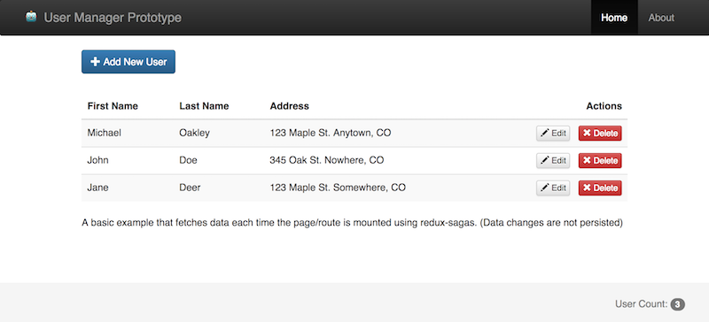

# User-manager
A demo react app that manages users.



## Installation
```
git clone https://github.com/oakley808/user-manager.git
yarn install
```

## Development
Run `yarn run start` and open a browser to http://localhost:3001

## Deployment
Build and push the `/build/` directory to GitHub pages.
```
yarn run build
git subtree push --prefix build origin gh-pages
```
Your app will be deployed at `https://<username>.github.io/user-manager/`


## Testing
Run `yarn run test` or `yarn run test:watch`

Unit test coverage can be found at `user-manager/coverage/lcov-report/index.html`

## Todo
* Add a pre-commit git hook to lint code and pre-push to run unit tests
* More form validation
* Wrap `<ErrorBoundary>` around page(s)
* Make running unit tests also run linter

## Questions
Questions? Feel free to file an issue in the Github issue tracker.
